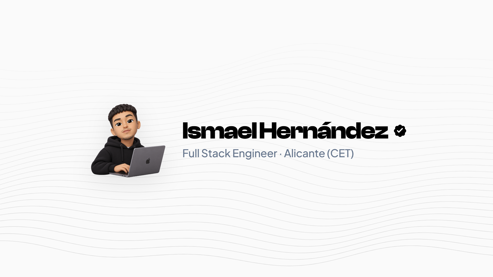

<div align="center">

  <!-- Header Banner -->
  

  <br/><br/>

  <!-- Dynamic Typing SVG Headline -->
  <a href="https://ismael-portfolio-flame.vercel.app/">
    
  </a>

  <br/><br/>

  <!-- Quick Action Badges -->
  <a href="https://ismael-portfolio-flame.vercel.app/" target="_blank">
    
  </a>
  &nbsp;
  <a href="mailto:ismaeldeveloperinfo@gmail.com">
    
  </a>
  &nbsp;
  <a href="https://github.com/IsmaaDev?tab=followers">
    
  </a>

</div>

<br/>

---

### 🎯 About Me

```bash
┌──(ismael㉿developer)-[~/whoami]
└─$ cat about.txt
```

- 🎓 **Full Stack Engineer** con base en Alicante, España (CET 🇪🇸).
- 💼 Especializado en el desarrollo de **aplicaciones web de alto impacto**, arquitecturas frontend reactivas y servicios backend escalables.
- ⚡ Pasión por el **Clean Code**, rendimiento extremo (Core Web Vitals), TypeScript robusto y diseño UI/UX de nivel editorial.
- 🌐 Explora mis proyectos seleccionados y experiencia en mi portfolio: [**ismael-portfolio-flame.vercel.app**](https://ismael-portfolio-flame.vercel.app/)

<br/>

---

### 🛠️ Technical Arsenal

#### 💻 Frontend Development
<p align="left">
  
  
  
  
  
  
  
  
</p>

#### ⚙️ Backend, Databases & APIs
<p align="left">
  
  
  
  
  
</p>

#### 🚀 DevOps, Tools & Design
<p align="left">
  
  
  
  
  
  
</p>

<br/>

---

### 🔥 Current Focus

```typescript
interface Engineer {
  name: string;
  role: string;
  location: string;
  philosophy: string[];
  currentFocus: string[];
}

const ismael: Engineer = {
  name: "Ismael Hernández",
  role: "Full Stack Engineer",
  location: "Alicante, Spain (CET 🇪🇸)",
  philosophy: [
    "Clean architecture & type-safe development",
    "High-performance user interfaces with sub-second load times",
    "Modern developer experience with scalable toolchains"
  ],
  currentFocus: [
    "Full-stack web applications with React, Next.js & Node.js",
    "Microservices, database optimization & edge functions",
    "Design systems & micro-interactions with Framer Motion"
  ]
};
```

<br/>

---

### ⚡ Engineering Standards

```bash
┌──(ismael㉿developer)-[~/standards]
└─$ cat milestones.txt
```

- [x] **Arquitectura Limpia & Modular:** Separación estricta de responsabilidades, componentes desacoplados y testing.
- [x] **Optimización de Rendimiento:** Zero lag, code-splitting eficiente y optimización de assets.
- [x] **Seguridad & Buenas Prácticas:** Sanitización de inputs, variables de entorno protegidas y encabezados seguros.
- [x] **Diseño UI Editorial:** Tipografías cuidadas, animaciones con propósito y accesibilidad.

<br/>

---

### 📊 GitHub Activity & Metrics

<div align="center">
  
  &nbsp;
  
</div>

<br/>

<!-- Snake Contribution Game Animation -->
<div align="center">
  <picture>
    <source media="(prefers-color-scheme: dark)" srcset="https://raw.githubusercontent.com/IsmaaDev/IsmaaDev/output/github-contribution-grid-snake-dark.svg">
    <source media="(prefers-color-scheme: light)" srcset="https://raw.githubusercontent.com/IsmaaDev/IsmaaDev/output/github-contribution-grid-snake.svg">
    
  </picture>
</div>

<br/>

---

### 📫 Connect With Me

<div align="center">
  <p><b>¿Creamos algo increíble juntos? Hablemos de nuevos proyectos y colaboraciones.</b></p>

  <a href="https://ismael-portfolio-flame.vercel.app/" target="_blank">
    
  </a>
  &nbsp;
  <a href="mailto:ismaeldeveloperinfo@gmail.com">
    
  </a>
  &nbsp;
  <a href="https://github.com/IsmaaDev">
    
  </a>

  <br/><br/>

  <p><i>🔒 "El mejor modo de predecir el futuro es programándolo."</i></p>
</div>
